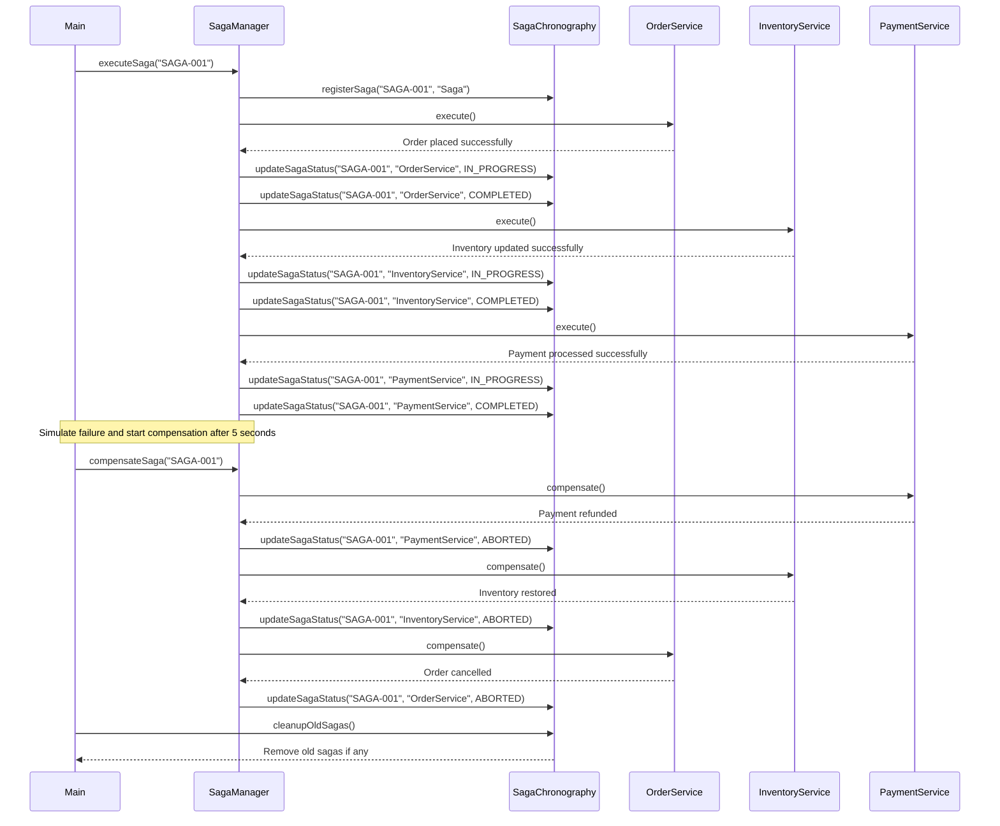

Certainly! Let's dive into implementing a Saga Chronography, which is a crucial aspect of managing distributed transactions in a microservices architecture. Saga Chronography helps in tracking and managing the lifecycle of a saga across multiple services.

### What is Saga Chronography?

Saga Chronography refers to the process of tracking and managing the chronological sequence of events within a saga. It involves monitoring the progress of each service in the saga and ensuring that the overall transaction remains consistent even if individual services fail.

### Key Components of Saga Chronography

1. **Saga Manager**: Oversees the entire saga process.
2. **Event Tracker**: Monitors the progress of individual services.
3. **Compensation Handler**: Manages the rollback process if needed.
4. **Time-based Expiration**: Ensures that long-running sagas don't block indefinitely.

### Java Implementation of Saga Chronography

Let's implement a Saga Chronography system using Java:

```java
import java.time.Instant;
import java.util.concurrent.CompletableFuture;
import java.util.concurrent.ConcurrentHashMap;
import java.util.concurrent.ConcurrentMap;
import java.util.concurrent.Executors;
import java.util.concurrent.ScheduledExecutorService;
import java.util.concurrent.TimeUnit;

class SagaChronography {
    private final ConcurrentMap<String, SagaEvent> sagaEvents;
    private final ScheduledExecutorService scheduler;

    public SagaChronography(int maxSagaAgeInSeconds) {
        this.sagaEvents = new ConcurrentHashMap<>();
        this.scheduler = Executors.newScheduledThreadPool(1);
        this.scheduler.scheduleAtFixedRate(this::cleanupOldSagas, 60, 60, TimeUnit.SECONDS);
    }

    public void registerSaga(String sagaId, String serviceName) {
        sagaEvents.putIfAbsent(sagaId, new SagaEvent(serviceName));
    }

    public void updateSagaStatus(String sagaId, String serviceName, SagaStatus status) {
        SagaEvent event = sagaEvents.computeIfPresent(sagaId, (id, existingEvent) -> {
            existingEvent.setStatus(status);
            return existingEvent;
        });
        if (event != null) {
            System.out.println("Updated saga status for " + sagaId + ": " + status);
        }
    }

    public SagaEvent getSagaEvent(String sagaId) {
        return sagaEvents.getOrDefault(sagaId, null);
    }

    public void cleanupOldSagas() {
        Instant now = Instant.now();
        sagaEvents.entrySet().removeIf(entry -> {
            SagaEvent event = entry.getValue();
            if (now.toEpochMilli() - event.getStartTime() > TimeUnit.SECONDS.toMillis(600)) {
                System.out.println("Removing old saga: " + entry.getKey());
                return true;
            }
            return false;
        });
    }

    public void shutdown() {
        scheduler.shutdownNow();
    }

    private static class SagaEvent {
        private final String serviceName;
        private SagaStatus status;
        private long startTime;

        public SagaEvent(String serviceName) {
            this.serviceName = serviceName;
            this.startTime = System.currentTimeMillis();
        }

        public String getServiceName() {
            return serviceName;
        }

        public SagaStatus getStatus() {
            return status;
        }

        public void setStatus(SagaStatus status) {
            this.status = status;
        }

        public long getStartTime() {
            return startTime;
        }
    }

    public enum SagaStatus {
        PENDING,
        IN_PROGRESS,
        COMPLETED,
        FAILED,
        ABORTED
    }
}

interface Service {
    CompletableFuture<Void> execute();
    CompletableFuture<Void> compensate();
}

class OrderService implements Service {
    @Override
    public CompletableFuture<Void> execute() {
        System.out.println("OrderService: Placing order");
        try {
            Thread.sleep(1000); // Simulating order processing time
            System.out.println("OrderService: Order placed successfully");
        } catch (InterruptedException e) {
            e.printStackTrace();
        }
        return CompletableFuture.completedFuture(null);
    }

    @Override
    public CompletableFuture<Void> compensate() {
        System.out.println("OrderService: Cancelling order");
        return CompletableFuture.completedFuture(null);
    }
}

class InventoryService implements Service {
    @Override
    public CompletableFuture<Void> execute() {
        System.out.println("InventoryService: Reducing inventory");
        try {
            Thread.sleep(2000); // Simulating inventory update time
            System.out.println("InventoryService: Inventory updated successfully");
        } catch (InterruptedException e) {
            e.printStackTrace();
        }
        return CompletableFuture.completedFuture(null);
    }

    @Override
    public CompletableFuture<Void> compensate() {
        System.out.println("InventoryService: Restoring inventory");
        return CompletableFuture.completedFuture(null);
    }
}

class PaymentService implements Service {
    @Override
    public CompletableFuture<Void> execute() {
        System.out.println("PaymentService: Processing payment");
        try {
            Thread.sleep(1500); // Simulating payment processing time
            System.out.println("PaymentService: Payment processed successfully");
        } catch (InterruptedException e) {
            e.printStackTrace();
        }
        return CompletableFuture.completedFuture(null);
    }

    @Override
    public CompletableFuture<Void> compensate() {
        System.out.println("PaymentService: Refunding payment");
        return CompletableFuture.completedFuture(null);
    }
}

class SagaManager {
    private final SagaChronography chronography;
    private final List<Service> services;

    public SagaManager(SagaChronography chronography, List<Service> services) {
        this.chronography = chronography;
        this.services = services;
    }

    public void executeSaga(String sagaId) throws InterruptedException, ExecutionException {
        chronography.registerSaga(sagaId, "Saga");
        for (Service service : services) {
            CompletableFuture<Void> future = service.execute();
            chronography.updateSagaStatus(sagaId, service.getClass().getSimpleName(), SagaChronography.SagaStatus.IN_PROGRESS);
            future.thenAccept(v -> {
                chronography.updateSagaStatus(sagaId, service.getClass().getSimpleName(), SagaChronography.SagaStatus.COMPLETED);
            }).exceptionally(ex -> {
                chronography.updateSagaStatus(sagaId, service.getClass().getSimpleName(), SagaChronography.SagaStatus.FAILED);
                return null;
            });
        }
    }

    public void compensateSaga(String sagaId) throws InterruptedException, ExecutionException {
        for (int i = services.size() - 1; i >= 0; i--) {
            Service service = services.get(i);
            CompletableFuture<Void> future = service.compensate();
            chronography.updateSagaStatus(sagaId, service.getClass().getSimpleName(), SagaChronography.SagaStatus.ABORTED);
            future.exceptionally(ex -> {
                // Log error and continue compensation
                System.out.println("Error during compensation: " + ex.getMessage());
                return null;
            });
        }
    }
}

// Usage
public class Main {
    public static void main(String[] args) throws InterruptedException, ExecutionException {
        SagaChronography chronography = new SagaChronography(600); // 10 minutes max age
        
        List<Service> services = List.of(
            new OrderService(),
            new InventoryService(),
            new PaymentService()
        );

        SagaManager manager = new SagaManager(chronography, services);

        String sagaId = "SAGA-001";
        System.out.println("Executing saga...");
        manager.executeSaga(sagaId);

        // Simulate failure after some time
        Thread.sleep(5000);

        System.out.println("\nCompensating saga...");
        manager.compensateSaga(sagaId);
    }
}
```

### Explanation of the Java Implementation

1. **SagaChronography**: This class manages the saga lifecycle and provides methods to register sagas, update their status, and clean up old sagas.

2. **SagaEvent**: Represents an event in the saga timeline, including the service name, status, and start time.

3. **SagaStatus**: Enumerates the possible statuses of a saga event.

4. **SagaManager**: Manages the execution and compensation of sagas using the SagaChronography.

5. **Service**: Interface for individual services involved in the saga.

6. **OrderService**, **InventoryService**, and **PaymentService**: Concrete implementations of services.

### Key Points to Consider

1. **Saga Lifecycle Tracking**: The `SagaChronography` keeps track of the entire saga lifecycle, allowing for monitoring and management.

2. **Time-based Expiration**: Old sagas are automatically cleaned up after a certain period.

3. **Asynchronous Execution**: Services are executed asynchronously using `CompletableFuture`.

4. **Error Handling**: Both successful completion and failures are handled gracefully.

5. **Compensation Logic**: Each service has a corresponding compensation method.

### Best Practices Implemented

1. **Separation of Concerns**: The `SagaChronography` focuses on tracking and managing saga lifecycles, while `SagaManager` handles the execution and compensation of sagas.

2. **Asynchronous Processing**: Using `CompletableFuture` allows for non-blocking execution of services.

3. **Error Handling**: Exceptions are caught and logged appropriately.

4. **Resource Management**: The `SagaChronography` uses a scheduled executor for periodic cleanup.

5. **Configurability**: The maximum saga age can be configured when creating the `SagaChronography`.

This implementation provides a robust foundation for managing distributed transactions using the Saga pattern. It includes features like saga lifecycle tracking, asynchronous processing, and compensation logic. To further enhance this system, you could add features like:

1. Distributed locking mechanisms for coordinating between services.
2. More sophisticated error handling and recovery strategies.
3. Integration with a distributed tracing system for better observability.
4. Support for long-running sagas that span across multiple days or weeks.

Remember to adapt this implementation based on your specific requirements and the complexity of your microservices architecture.