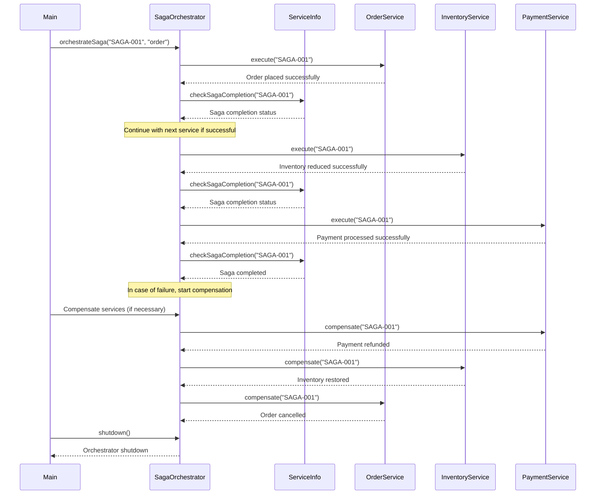

Certainly! Let's explore saga orchestration, which is a crucial aspect of managing distributed transactions in microservices architectures. Saga orchestration involves coordinating the execution of multiple services to achieve a complex business process.

### What is Saga Orchestration?

Saga orchestration is the process of managing and coordinating the execution of multiple services within a saga. It involves planning, sequencing, and controlling the flow of work across these services to ensure the overall transaction completes successfully.

### Key Components of Saga Orchestration

1. **Orchestrator**: Manages the overall workflow of the saga.
2. **Service Registry**: Keeps track of available services and their capabilities.
3. **Message Broker**: Facilitates communication between services.
4. **Compensation Handler**: Manages the rollback process if needed.

### Java Implementation of Saga Orchestration

Let's implement a saga orchestrator using Java:

```java
import java.util.*;
import java.util.concurrent.CompletableFuture;
import java.util.concurrent.ConcurrentHashMap;
import java.util.concurrent.ExecutorService;
import java.util.concurrent.Executors;
import java.util.concurrent.atomic.AtomicBoolean;

class SagaOrchestrator {
    private final Map<String, ServiceInfo> serviceRegistry;
    private final ExecutorService executor;

    public SagaOrchestrator(int maxConcurrentSagas) {
        this.serviceRegistry = new ConcurrentHashMap<>();
        this.executor = Executors.newFixedThreadPool(maxConcurrentSagas);
    }

    public void registerService(String serviceName, ServiceInfo serviceInfo) {
        serviceRegistry.put(serviceName, serviceInfo);
    }

    public CompletableFuture<Void> orchestrateSaga(String sagaId, String initialService) throws InterruptedException {
        AtomicBoolean sagaCompleted = new AtomicBoolean(false);

        return CompletableFuture.runAsync(() -> {
            System.out.println("Starting saga orchestration for " + sagaId);
            executeService(initialService, sagaId, sagaCompleted);
        }, executor);
    }

    private void executeService(String serviceName, String sagaId, AtomicBoolean sagaCompleted) {
        if (!serviceRegistry.containsKey(serviceName)) {
            throw new RuntimeException("Unknown service: " + serviceName);
        }

        ServiceInfo info = serviceRegistry.get(serviceName);
        System.out.println("Executing service: " + serviceName + ", Saga ID: " + sagaId);

        CompletableFuture<Void> future = info.execute(sagaId);
        future.thenAccept(v -> {
            System.out.println("Service " + serviceName + " completed successfully");
            checkSagaCompletion(sagaId, sagaCompleted);
        }).exceptionally(ex -> {
            System.err.println("Error executing service " + serviceName + ": " + ex.getMessage());
            compensateService(sagaId, serviceName);
            return null;
        });
    }

    private void checkSagaCompletion(String sagaId, AtomicBoolean sagaCompleted) {
        if (sagaCompleted.compareAndSet(false, true)) {
            System.out.println("Saga " + sagaId + " completed successfully");
        } else {
            System.out.println("Saga " + sagaId + " already completed");
        }
    }

    private void compensateService(String sagaId, String serviceName) {
        System.out.println("Compensating service: " + serviceName + ", Saga ID: " + sagaId);
        ServiceInfo info = serviceRegistry.get(serviceName);
        info.compensate(sagaId);
    }

    public void shutdown() {
        executor.shutdownNow();
    }

    static class ServiceInfo {
        private final String serviceName;
        private final Function<String, CompletableFuture<Void>> executeFunction;
        private final BiConsumer<String, Throwable> compensationFunction;

        public ServiceInfo(String serviceName, Function<String, CompletableFuture<Void>> executeFunction, BiConsumer<String, Throwable> compensationFunction) {
            this.serviceName = serviceName;
            this.executeFunction = executeFunction;
            this.compensationFunction = compensationFunction;
        }

        public CompletableFuture<Void> execute(String sagaId) {
            return executeFunction.apply(sagaId);
        }

        public void compensate(String sagaId) {
            compensationFunction.accept(sagaId, null);
        }
    }

    @FunctionalInterface
    interface Function<T, R> {
        R apply(T t);
    }

    @FunctionalInterface
    interface BiConsumer<T, U> {
        void accept(T t, U u);
    }
}

interface Service {
    CompletableFuture<Void> execute(String sagaId);
    void compensate(String sagaId);
}

// Sample services
class OrderService implements Service {
    @Override
    public CompletableFuture<Void> execute(String sagaId) {
        System.out.println("OrderService: Placing order for " + sagaId);
        // Simulate order placement
        return CompletableFuture.completedFuture(null);
    }

    @Override
    public void compensate(String sagaId) {
        System.out.println("OrderService: Cancelling order for " + sagaId);
        // Simulate order cancellation
    }
}

class InventoryService implements Service {
    @Override
    public CompletableFuture<Void> execute(String sagaId) {
        System.out.println("InventoryService: Reducing inventory for " + sagaId);
        // Simulate inventory reduction
        return CompletableFuture.completedFuture(null);
    }

    @Override
    public void compensate(String sagaId) {
        System.out.println("InventoryService: Restoring inventory for " + sagaId);
        // Simulate inventory restoration
    }
}

class PaymentService implements Service {
    @Override
    public CompletableFuture<Void> execute(String sagaId) {
        System.out.println("PaymentService: Processing payment for " + sagaId);
        // Simulate payment processing
        return CompletableFuture.completedFuture(null);
    }

    @Override
    public void compensate(String sagaId) {
        System.out.println("PaymentService: Refunding payment for " + sagaId);
        // Simulate refund
    }
}

// Usage
public class Main {
    public static void main(String[] args) throws InterruptedException {
        SagaOrchestrator orchestrator = new SagaOrchestrator(10); // Max 10 concurrent sagas

        // Register services
        orchestrator.registerService("order", new SagaOrchestrator.ServiceInfo("OrderService", s -> new OrderService().execute(s), (s, e) -> new OrderService().compensate(s)));
        orchestrator.registerService("inventory", new SagaOrchestrator.ServiceInfo("InventoryService", s -> new InventoryService().execute(s), (s, e) -> new InventoryService().compensate(s)));
        orchestrator.registerService("payment", new SagaOrchestrator.ServiceInfo("PaymentService", s -> new PaymentService().execute(s), (s, e) -> new PaymentService().compensate(s)));

        // Start a saga
        String sagaId = "SAGA-001";
        orchestrator.orchestrateSaga(sagaId, "order").join();

        // Shutdown the orchestrator
        orchestrator.shutdown();
    }
}
```

### Explanation of the Java Implementation

1. **SagaOrchestrator**: Manages the overall workflow of sagas, including service registration, saga orchestration, and compensation.

2. **ServiceInfo**: Represents information about a registered service, including its execution function and compensation function.

3. **Service Interface**: Defines the contract for individual services involved in the saga.

4. **OrderService**, **InventoryService**, and **PaymentService**: Concrete implementations of services.

### Key Points to Consider

1. **Concurrency Control**: The `SagaOrchestrator` manages concurrency by limiting the number of active sagas.

2. **Service Registry**: Services are registered with the orchestrator, allowing dynamic management of available services.

3. **Asynchronous Execution**: Services are executed asynchronously using `CompletableFuture`.

4. **Compensation Logic**: Each service has a corresponding compensation method.

5. **Saga Lifecycle Management**: The orchestrator tracks the progress of each saga and handles compensation when necessary.

### Best Practices Implemented

1. **Separation of Concerns**: The `SagaOrchestrator` focuses on managing the saga lifecycle, while individual services handle their specific operations.

2. **Asynchronous Processing**: Using `CompletableFuture` allows for non-blocking execution of services.

3. **Error Handling**: Exceptions are caught and logged appropriately.

4. **Resource Management**: The `SagaOrchestrator` uses an `ExecutorService` for efficient task management.

5. **Configurability**: The maximum number of concurrent sagas can be configured when creating the `SagaOrchestrator`.

### Enhancements and Considerations

1. **Distributed Locking**: Implement distributed locking mechanisms for coordinating between services.

2. **Eventual Consistency**: Handle eventual consistency scenarios where services may operate independently.

3. **Retry Mechanism**: Implement retry logic for transient failures.

4. **Monitoring and Logging**: Integrate with a robust monitoring and logging system for better observability.

5. **Configuration Management**: Move configuration parameters to external sources (e.g., environment variables, configuration files).

6. **Testing**: Develop unit tests and integration tests to ensure proper functioning of the saga orchestrator and individual services.

7. **Security**: Implement authentication and authorization mechanisms for accessing the saga orchestrator.

8. **Scalability**: Design the system to scale horizontally, possibly using a microservices architecture for the orchestrator itself.

This implementation provides a solid foundation for saga orchestration in a microservices architecture. It can be further extended to support more complex business processes, integrate with existing systems, and adapt to specific requirements of your application domain.