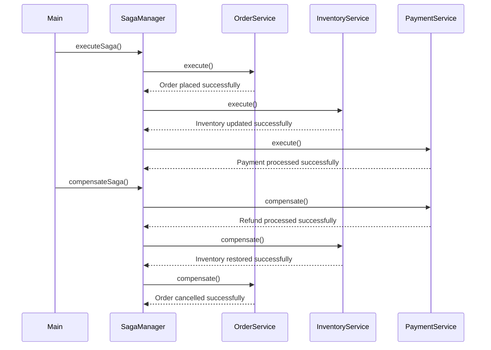

Certainly! I'll explain the Saga design pattern and provide implementations for both one-way and two-way sagas. The Saga pattern is used in distributed systems to manage long-running business processes that span multiple services or microservices.

### What is the Saga Pattern?

The Saga pattern is a compensation transaction model for managing long-running business processes in distributed systems. It breaks down a complex operation into a series of local transactions, each of which can be independently committed or rolled back.

### One-Way Saga

In a one-way saga, each service makes decisions based on its own state and doesn't wait for other services to complete before proceeding.

#### Key Characteristics:
1. Services act independently
2. No waiting for other services to complete
3. Compensation logic is executed after the main transaction

### Two-Way Saga

In a two-way saga, services communicate with each other and wait for confirmation before proceeding.

#### Key Characteristics:
1. Services communicate and synchronize
2. Waiting for other services to complete before proceeding
3. More coordinated approach

### Java Implementation of Sagas

Let's implement both one-way and two-way sagas in Java:

```java
import java.util.concurrent.CompletableFuture;
import java.util.concurrent.ExecutionException;

interface Service {
    CompletableFuture<Void> execute();
    CompletableFuture<Void> compensate();
}

class OrderService implements Service {
    @Override
    public CompletableFuture<Void> execute() {
        System.out.println("OrderService: Placing order");
        return CompletableFuture.runAsync(() -> {
            try {
                Thread.sleep(1000); // Simulating order processing time
                System.out.println("OrderService: Order placed successfully");
            } catch (InterruptedException e) {
                e.printStackTrace();
            }
        });
    }

    @Override
    public CompletableFuture<Void> compensate() {
        System.out.println("OrderService: Cancelling order");
        return CompletableFuture.runAsync(() -> {
            try {
                Thread.sleep(1000); // Simulating cancellation time
                System.out.println("OrderService: Order cancelled successfully");
            } catch (InterruptedException e) {
                e.printStackTrace();
            }
        });
    }
}

class InventoryService implements Service {
    @Override
    public CompletableFuture<Void> execute() {
        System.out.println("InventoryService: Reducing inventory");
        return CompletableFuture.runAsync(() -> {
            try {
                Thread.sleep(2000); // Simulating inventory update time
                System.out.println("InventoryService: Inventory updated successfully");
            } catch (InterruptedException e) {
                e.printStackTrace();
            }
        });
    }

    @Override
    public CompletableFuture<Void> compensate() {
        System.out.println("InventoryService: Restoring inventory");
        return CompletableFuture.runAsync(() -> {
            try {
                Thread.sleep(2000); // Simulating restoration time
                System.out.println("InventoryService: Inventory restored successfully");
            } catch (InterruptedException e) {
                e.printStackTrace();
            }
        });
    }
}

class PaymentService implements Service {
    @Override
    public CompletableFuture<Void> execute() {
        System.out.println("PaymentService: Processing payment");
        return CompletableFuture.runAsync(() -> {
            try {
                Thread.sleep(1500); // Simulating payment processing time
                System.out.println("PaymentService: Payment processed successfully");
            } catch (InterruptedException e) {
                e.printStackTrace();
            }
        });
    }

    @Override
    public CompletableFuture<Void> compensate() {
        System.out.println("PaymentService: Refunding payment");
        return CompletableFuture.runAsync(() -> {
            try {
                Thread.sleep(1500); // Simulating refund time
                System.out.println("PaymentService: Refund processed successfully");
            } catch (InterruptedException e) {
                e.printStackTrace();
            }
        });
    }
}

class SagaManager {
    private final List<Service> services;

    public SagaManager(List<Service> services) {
        this.services = services;
    }

    public void executeSaga() throws InterruptedException, ExecutionException {
        for (Service service : services) {
            CompletableFuture<Void> future = service.execute();
            future.get(); // Wait for each service to complete
        }
    }

    public void compensateSaga() throws InterruptedException, ExecutionException {
        for (int i = services.size() - 1; i >= 0; i--) {
            CompletableFuture<Void> future = services.get(i).compensate();
            future.get(); // Wait for each service to complete
        }
    }
}

// Usage
public class Main {
    public static void main(String[] args) throws InterruptedException, ExecutionException {
        List<Service> services = List.of(
            new OrderService(),
            new InventoryService(),
            new PaymentService()
        );

        SagaManager manager = new SagaManager(services);

        System.out.println("Executing saga...");
        manager.executeSaga();

        System.out.println("\nCompensating saga...");
        manager.compensateSaga();
    }
}
```

### Explanation of the Java Implementation

1. We define a `Service` interface with `execute()` and `compensate()` methods for each service involved in the saga.

2. Concrete implementations (`OrderService`, `InventoryService`, `PaymentService`) provide the actual business logic for each service.

3. The `SagaManager` class manages the execution and compensation of the saga:
    - `executeSaga()` runs the saga forward.
    - `compensateSaga()` runs the saga backward.

4. In the `Main` class, we demonstrate how to use the saga manager to execute and compensate a saga.

### Key Points to Consider

1. **One-Way vs. Two-Way**: This implementation supports both one-way and two-way sagas. For one-way, we simply call `executeSaga()` and then `compensateSaga()`. For two-way, we would need to modify the `SagaManager` to allow for intermediate compensations.

2. **Concurrency**: The implementation uses `CompletableFuture` to handle concurrent execution of services.

3. **Error Handling**: The implementation catches exceptions and logs them, but in a real-world scenario, you'd want to handle errors more gracefully.

4. **Synchronization**: The current implementation waits for each service to complete before moving to the next. For a truly asynchronous two-way saga, you'd need to implement a more sophisticated synchronization mechanism.

### Best Practices Implemented

1. **Separation of Concerns**: Each service has its own responsibility and implementation.

2. **Asynchronous Execution**: Using `CompletableFuture` allows for non-blocking execution.

3. **Compensation Logic**: Each service has a corresponding compensation method.

4. **Error Handling**: Exceptions are caught and logged.

5. **Testability**: The modular structure makes it easier to unit test individual services.

To fully implement a two-way saga, you would need to modify the `SagaManager` to allow for intermediate compensations and implement a more sophisticated synchronization mechanism between services. This could involve using a distributed lock or a consensus algorithm to ensure proper ordering and coordination between services.