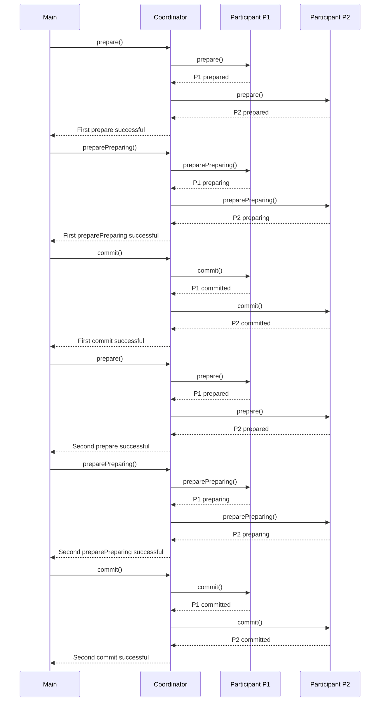

Certainly! I'll explain three-phase commit (3PC) and provide a Java implementation. Three-phase commit is an extension of the two-phase commit protocol that aims to improve reliability and reduce the risk of blocking transactions.

### What is Three-Phase Commit?

Three-phase commit is an enhanced version of the two-phase commit protocol. It introduces a third phase called "preparing" to further improve the reliability of distributed transactions.

The three phases are:
1. Prepare
2. Preparing
3. Commit

### How Three-Phase Commit Works

1. **Prepare Phase:**
    - The coordinator sends a "prepare" message to all participants.
    - Participants prepare to commit but do not commit yet.
    - Participants send "ready" or "not ready" messages back to the coordinator.

2. **Preparing Phase:**
    - If all participants said "ready", the coordinator sends a "prepare" message to all participants again.
    - Participants make their changes permanent but don't notify the coordinator yet.

3. **Commit Phase:**
    - If all participants acknowledged the second "prepare" message, the coordinator sends a "commit" message to all participants.
    - All participants confirm that they have committed successfully.

### Java Implementation of Three-Phase Commit

Here's a Java implementation of three-phase commit:

```java
import java.util.ArrayList;
import java.util.List;

enum State {
    PREPARED,
    PREPARING,
    COMMITTED,
    ABORTED
}

class Participant {
    private final String name;
    private State state = State.PREPARED;

    public Participant(String name) {
        this.name = name;
    }

    public void prepare() {
        System.out.println(name + " prepared");
        state = State.PREPARED;
    }

    public boolean preparePreparing() {
        if (state == State.PREPARED) {
            System.out.println(name + " preparing");
            state = State.PREPARING;
            return true;
        }
        return false;
    }

    public boolean commit() {
        if (state == State.PREPARING) {
            System.out.println(name + " committed");
            state = State.COMMITTED;
            return true;
        }
        return false;
    }

    public void abort() {
        System.out.println(name + " aborted");
        state = State.ABORTED;
    }
}

class Coordinator {
    private List<Participant> participants = new ArrayList<>();
    private State state = State.PREPARED;

    public void addParticipant(Participant participant) {
        participants.add(participant);
    }

    public boolean prepare() {
        System.out.println("Coordinator preparing...");
        for (Participant participant : participants) {
            participant.prepare();
        }
        boolean allReady = true;
        for (Participant participant : participants) {
            if (participant.state != State.PREPARED) {
                allReady = false;
                break;
            }
        }
        state = allReady ? State.PREPARED : State.ABORTED;
        return state == State.PREPARED;
    }

    public boolean preparePreparing() {
        if (state == State.PREPARED) {
            System.out.println("Coordinator preparing...");
            for (Participant participant : participants) {
                if (!participant.preparePreparing()) {
                    abort();
                    return false;
                }
            }
            state = State.PREPARING;
            return true;
        }
        return false;
    }

    public boolean commit() {
        if (state == State.PREPARING) {
            System.out.println("Coordinator committing...");
            for (Participant participant : participants) {
                if (!participant.commit()) {
                    abort();
                    return false;
                }
            }
            state = State.COMMITTED;
            return true;
        }
        return false;
    }

    public void abort() {
        System.out.println("Coordinator aborting...");
        state = State.ABORTED;
        for (Participant participant : participants) {
            participant.abort();
        }
    }
}

public class Main {
    public static void main(String[] args) {
        Coordinator coord = new Coordinator();

        Participant p1 = new Participant("P1");
        Participant p2 = new Participant("P2");

        coord.addParticipant(p1);
        coord.addParticipant(p2);

        // First attempt at commit
        if (coord.prepare()) {
            System.out.println("First prepare successful");
            if (coord.preparePreparing()) {
                System.out.println("First preparePreparing successful");
                if (coord.commit()) {
                    System.out.println("First commit successful");
                } else {
                    System.out.println("First commit failed");
                }
            } else {
                System.out.println("First preparePreparing failed");
            }
        } else {
            System.out.println("First prepare failed");
        }

        // Second attempt at commit
        if (coord.prepare()) {
            System.out.println("Second prepare successful");
            if (coord.preparePreparing()) {
                System.out.println("Second preparePreparing successful");
                if (coord.commit()) {
                    System.out.println("Second commit successful");
                } else {
                    System.out.println("Second commit failed");
                }
            } else {
                System.out.println("Second preparePreparing failed");
            }
        } else {
            System.out.println("Second prepare failed");
        }
    }
}
```

### Explanation of the Java Implementation

1. We've added a new state `PREPARING` to the `State` enum to represent the third phase.

2. The `Participant` class now has methods for all three phases:
    - `prepare()`: Simulates the first prepare phase.
    - `preparePreparing()`: Simulates the preparing phase.
    - `commit()`: Simulates the final commit phase.

3. The `Coordinator` class has been updated to support all three phases:
    - `prepare()`: Initiates the first prepare phase.
    - `preparePreparing()`: Initiates the preparing phase.
    - `commit()`: Completes the final commit phase.

4. In the `Main` class, we demonstrate two attempts at committing a transaction, showing how the three-phase commit protocol handles all three phases.

### Key Points to Consider

1. **Improved Reliability:** 3PC reduces the risk of blocking transactions compared to 2PC.

2. **Asynchronous Communication:** The preparing phase allows for asynchronous communication, potentially improving performance.

3. **Better Error Handling:** If a failure occurs during the preparing phase, only the affected participants need to roll back.

4. **Complexity:** 3PC is more complex than 2PC, which can increase implementation and maintenance costs.

### Best Practices Implemented

1. **Encapsulation**: Both `Participant` and `Coordinator` classes encapsulate their behavior and state.

2. **Separation of Concerns**: The coordinator and participants have separate responsibilities.

3. **State Management**: The state of each participant and the overall transaction is managed explicitly.

4. **Error Handling**: The abort method simulates error handling during all phases.

5. **Logging**: System.out.println statements serve as simple logging mechanisms.

6. **Flexibility**: The implementation allows for multiple attempts at committing a transaction, demonstrating the flexibility of 3PC.

This Java implementation provides a comprehensive overview of the three-phase commit protocol. It can be further extended with additional features such as timeout handling, more sophisticated error recovery strategies, and integration with actual database systems.