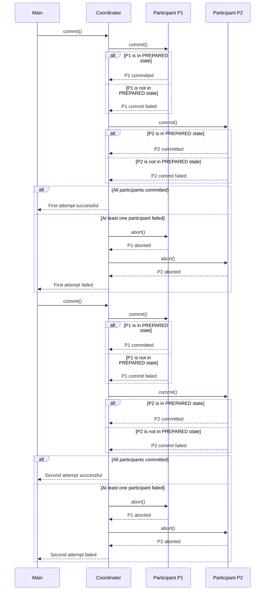

Certainly! I'll provide a Java implementation of the Two-Phase Commit protocol. This example will include both the Coordinator and Participant classes, along with a main method to demonstrate usage.

### Java Implementation of Two-Phase Commit

```java
import java.util.ArrayList;
import java.util.List;

enum State {
    PREPARED,
    COMMITTED,
    ABORTED
}

class Participant {
    private final String name;
    private State state = State.PREPARED;

    public Participant(String name) {
        this.name = name;
    }

    public void prepare() {
        System.out.println(name + " prepared");
        state = State.PREPARED;
    }

    public boolean commit() {
        if (state == State.PREPARED) {
            System.out.println(name + " committed");
            state = State.COMMITTED;
            return true;
        }
        return false;
    }

    public void abort() {
        System.out.println(name + " aborted");
        state = State.ABORTED;
    }
}

class Coordinator {
    private List<Participant> participants = new ArrayList<>();
    private State state = State.PREPARED;

    public void addParticipant(Participant participant) {
        participants.add(participant);
    }

    public boolean prepare() {
        System.out.println("Coordinator preparing...");
        for (Participant participant : participants) {
            participant.prepare();
        }
        boolean allReady = true;
        for (Participant participant : participants) {
            if (participant.state != State.PREPARED) {
                allReady = false;
                break;
            }
        }
        state = allReady ? State.PREPARED : State.ABORTED;
        return state == State.PREPARED;
    }

    public boolean commit() {
        if (state == State.PREPARED) {
            System.out.println("Coordinator committing...");
            for (Participant participant : participants) {
                if (!participant.commit()) {
                    abort();
                    return false;
                }
            }
            state = State.COMMITTED;
            return true;
        }
        return false;
    }

    public void abort() {
        System.out.println("Coordinator aborting...");
        state = State.ABORTED;
        for (Participant participant : participants) {
            participant.abort();
        }
    }
}

public class Main {
    public static void main(String[] args) {
        Coordinator coord = new Coordinator();

        Participant p1 = new Participant("P1");
        Participant p2 = new Participant("P2");

        coord.addParticipant(p1);
        coord.addParticipant(p2);

        // First attempt at commit
        if (coord.commit()) {
            System.out.println("First attempt successful");
        } else {
            System.out.println("First attempt failed");
        }

        // Second attempt at commit
        if (coord.commit()) {
            System.out.println("Second attempt successful");
        } else {
            System.out.println("Second attempt failed");
        }
    }
}
```

### Explanation of the Java Implementation

1. We define an `enum` called `State` to represent the different states a participant or coordinator can be in.

2. The `Participant` class represents individual database nodes. It has methods to prepare, commit, and abort operations.

3. The `Coordinator` class manages the two-phase commit process. It keeps track of participants and controls the flow of the transaction.

4. In the `Main` class, we demonstrate the usage of the Two-Phase Commit protocol with two participants.

### Key Points to Consider

1. This implementation simulates the two-phase commit process:
    - Preparation phase: All participants are prepared.
    - Commitment phase: Only if all participants are prepared will the coordinator proceed to commit.

2. Error handling is simulated through the `abort()` method. If any participant fails to commit, the entire transaction is aborted.

3. The coordinator keeps track of the overall state of the transaction.

4. The main method demonstrates two attempts at committing a transaction, showing how the protocol handles both successful and failed commits.

### Best Practices Implemented

1. **Encapsulation**: Both `Participant` and `Coordinator` classes encapsulate their behavior and state.

2. **Separation of Concerns**: The coordinator and participants have separate responsibilities.

3. **State Management**: The state of each participant and the overall transaction is managed explicitly.

4. **Error Handling**: The abort method simulates error handling during the commit phase.

5. **Logging**: System.out.println statements serve as simple logging mechanisms.

This Java implementation provides a solid foundation for understanding and working with the Two-Phase Commit protocol. It can be extended with additional features like timeouts, more sophisticated error recovery strategies, and integration with actual database systems.